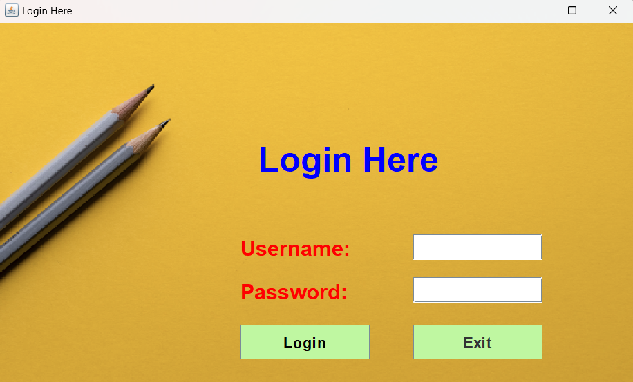

# Employee Database Management System

The **Employee Database Management System** is a Java-based application designed to efficiently manage employee records. It supports key operations like adding, updating, deleting, and retrieving employee information. The system integrates with a MySQL database for storing data, and the user interface is built using **Swing**.

## 🖼️ Screenshots 

### Dashboard & Add Employee | Update & Delete Employee

<table>
  <tr>
    <td></td>
    <td></td>
  </tr>
  <tr>
   
  </tr>
</table>


## 🚀 Key Features  
- **Add Employees**: Store employee details such as Name, Employee ID, Department, and Salary.
- **Update Records**: Modify existing employee data when needed.
- **Delete Employees**: Remove employee records from the system.
- **View Employee Data**: Display a list of all employees in a well-organized format.
- **Search Functionality**: Find employees by their Employee ID or Name.

## 🛠️ Technologies Used  
- **Programming Language**: Java  
- **Database**: MySQL  
- **GUI Framework**: Swing  
- **IDE**: IntelliJ IDEA / Eclipse / NetBeans  

## 📂 Project Directory Structure  
The project is organized into logical components to maintain a clear structure. 

## 🎯 Prerequisites  
Before running the project, make sure the following software is installed:  
- **Java JDK** (Version 8 or above)  
- **MySQL Database Server**  
- **JDBC Driver for MySQL**  
- **IDE** (IntelliJ, Eclipse, NetBeans, etc.)

## 🔧 Setup & Installation  
Follow these steps to get the project up and running:

1. **Clone the Repository**  
   Run the following command to clone the project:
   ```bash
   git clone https://github.com/your-username/Employee-Database-Management-System.git

2. **Database Configuration**
   In your project, update the database connection URL, username, and password:
   ```bash
   String url = "jdbc:mysql://localhost:3306/employee_db";  
   String user = "your_username";  
   String password = "your_password";
3. **Create a New Branch**
   To work on features or modifications, create a new branch:
   ```bash
   git checkout -b feature-new

   


