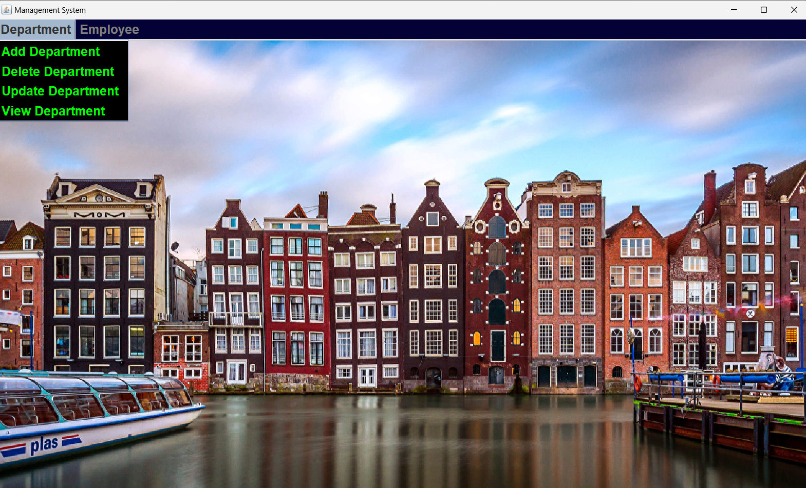
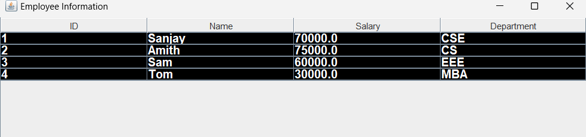
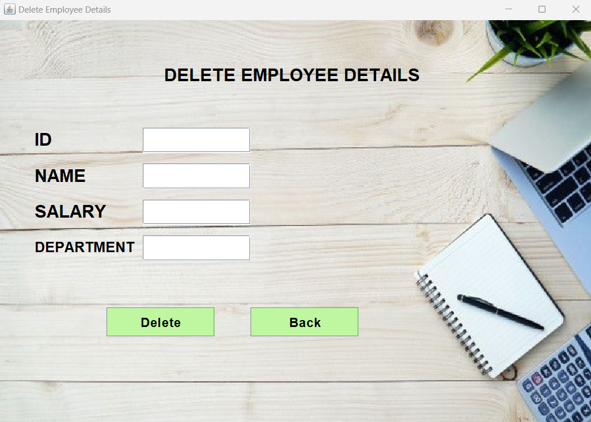
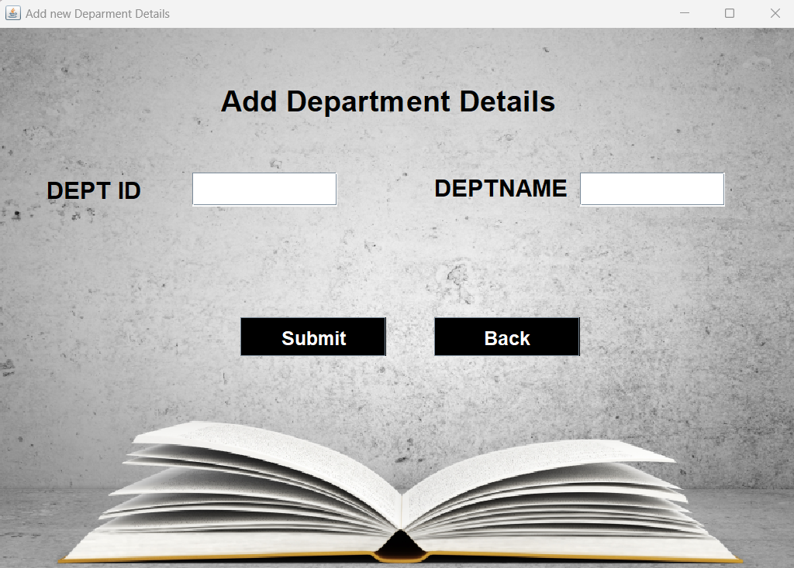
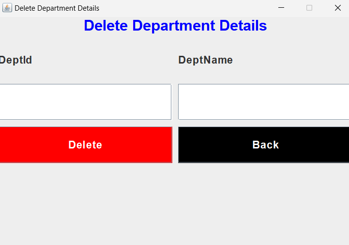

# Employee Database Management System

The **Employee Database Management System** is a Java-based application designed to efficiently manage employee records. It supports key operations like adding, updating, deleting, and retrieving employee information. The system integrates with a MySQL database for storing data, and the user interface is built using **Swing**.

##  Screenshots 
<table>
  <h3>
    Login & Dashboard 
  </h3>


  <tr>
    <td></td>
    <td></td>
  </tr>


</table>

<table>
  <h3> Add & View Employee | Update & Delete Employee </h3>
  <tr>
    <td></td>
    <td></td>
    <td></td>
    <td></td>
  </tr>
</table>

<table>
  <h3> Add & View Department | Update & Delete Department </h3>
  <tr>
    <td></td>
    <td></td>
    <td></td>
    <td></td>
  </tr>
</table>


##  Key Features  
- **Add Employees**: Store employee details such as Name, Employee ID, Department, and Salary.
- **Update Records**: Modify existing employee data when needed.
- **Delete Employees**: Remove employee records from the system.
- **View Employee Data**: Display a list of all employees in a well-organized format.
- **Search Functionality**: Find employees by their Employee ID or Name.

##  Technologies Used  
- **Programming Language**: Java  
- **Database**: MySQL  
- **GUI Framework**: Swing  
- **IDE**: IntelliJ IDEA / Eclipse / NetBeans  

##  Project Directory Structure  
The project is organized into logical components to maintain a clear structure. 

##  Prerequisites  
Before running the project, make sure the following software is installed:  
- **Java JDK** (Version 8 or above)  
- **MySQL Database Server**  
- **JDBC Driver for MySQL**  
- **IDE** (IntelliJ, Eclipse, NetBeans, etc.)

##  Setup & Installation  
Follow these steps to get the project up and running:

1. **Clone the Repository**  
   Run the following command to clone the project:
   ```bash
   git clone https://github.com/your-username/Employee-Database-Management-System.git

2. **Database Configuration**

   In your project, update the database connection URL, username, and password:
   ```bash
   String url = "jdbc:mysql://localhost:3306/employee_db";  
   String user = "your_username";  
   String password = "your_password";
   
4. **Create a New Branch** 

   To work on features or modifications, create a new branch:
   ```bash
   git checkout -b feature-new
   ```

##  Use Cases

- HR departments to maintain and update employee records.
- Small businesses looking for a lightweight desktop-based employee manager.
- Academic demonstration of CRUD operations using Java and MySQL.


   
##  Future Enhancements

- Add role-based access (Admin, HR, Viewer).
- Export employee data to Excel or PDF.
- Implement login and session management.
- Add validations and error-handling mechanisms.
- Migrate to a web-based interface using Spring Boot + React.

##  Contributing

Contributions are welcome! If you have suggestions or improvements, feel free to open an issue or submit a pull request.

1. Fork the repository
2. Create your feature branch (`git checkout -b feature/AmazingFeature`)
3. Commit your changes (`git commit -m 'Add some AmazingFeature'`)
4. Push to the branch (`git push origin feature/AmazingFeature`)
5. Open a pull request


